# The Obsidian — Luxury Hotel Platform

**Flawlessly Dark. Infinitely Refined.**

The Obsidian is a full-stack Django web application for an ultra-luxury boutique hotel set in a converted Victorian printworks in central London. It runs both the guest-facing booking experience and the back-of-house operation on one platform: guests book through a dates-first flow, pre-order packages, pay a deposit online and manage their reservations; receptionists handle arrivals, departures and the room board; managers oversee bookings, payments, housekeeping and the hotel's outstanding balance.

This project was built for the Code Institute Level 5 Diploma in Web Application Development — Unit 4: Full Stack Frameworks with Django.

The deployed application can be found here: **[https://web-production-b1210.up.railway.app]**

---

## Table of Contents

1. [Project Purpose and Rationale](#1-project-purpose-and-rationale)
2. [Target Audience and User Stories](#2-target-audience-and-user-stories)
3. [UX and UI Design](#3-ux-and-ui-design)
4. [Wireframes](#4-wireframes)
5. [Database Design](#5-database-design)
6. [Features](#6-features)
7. [Django Templates](#7-django-templates)
8. [Security](#8-security)
9. [Testing](#9-testing)
10. [Validation](#10-validation)
11. [Bugs and Fixes](#11-bugs-and-fixes)
12. [Deployment](#12-deployment)
13. [How to Use the Application](#13-how-to-use-the-application)
14. [Technologies Used](#14-technologies-used)
15. [Credits and Attributions](#15-credits-and-attributions)
16. [File-by-File Code Reference](#16-file-by-file-code-reference)

---

## 1. Project Purpose and Rationale

Independent luxury hotels often run their guest bookings and their internal operations on separate, disconnected systems. A guest books on a website; the front desk works from a different tool; housekeeping and management work from yet another. Information falls between the gaps — a guest's pre-ordered champagne never reaches the room, a balance goes uncollected, a room is double-booked.

The Obsidian platform solves this by putting all three on one shared data model. When a guest books and pays a deposit, the receptionist immediately sees the arrival and the balance still to collect, and the manager sees the booking reflected in occupancy and revenue. Availability is derived live from the bookings themselves, so the moment a guest edits or cancels, the freed dates become bookable by others — automatically.

The rationale is therefore a single source of truth: one relational database, three role-tailored interfaces, and live data shared between them. The purpose is evident to any new user the moment they land — a hotel where you book your stay and the hotel runs on the same system.

---

## 2. Target Audience and User Stories

The platform serves three related audiences, each with a clear reason to hold an account.

### Guests
> - As a guest, I want to search by my dates first so that I only see rooms I can actually book.
> - As a guest, I want to see which room types are available, limited, or fully booked for my dates so that I can decide quickly.
> - As a guest, I want to pre-order food, spa and occasion packages so that everything is ready when I arrive.
> - As a guest, I want to pay a deposit securely online so that my booking is confirmed.
> - As a guest, I want to edit my booking — dates, room, packages — so that I stay in control when plans change.
> - As a guest, I want to see exactly what I have paid and what I still owe so that there are no surprises.
> - As a guest, I want to submit a concierge request and agree a time so that bespoke needs are handled.
> - As a guest, I want to earn loyalty points so that I am rewarded for returning.

### Receptionists
> - As a receptionist, I want to see today's arrivals and departures so that I can prepare for each guest.
> - As a receptionist, I want to see the balance owed on each booking so that I know what to collect.
> - As a receptionist, I want a live room board so that I can see the state of every room at a glance.
> - As a receptionist, I want to handle concierge requests so that I can accept or propose a time.

### Managers
> - As a manager, I want to see occupancy and revenue so that I can judge performance.
> - As a manager, I want the total outstanding balance across the hotel so that I can track money owed.
> - As a manager, I want to see every booking with its payment status so that nothing is missed.
> - As a manager, I want a housekeeping list so that rooms are turned around promptly.

---

## 3. UX and UI Design

### Design Rationale
The brand position is restraint as luxury. The interface is deliberately dark — near-black backgrounds (#0D0D0D, #1A1A1A) with a single restrained gold accent (#C9A84C) and a recurring diamond ◆ motif. Nothing shouts. The typography pairs **Cormorant Garamond** (an elegant serif, for display headings) with **Montserrat** (a clean sans-serif, for body text). The result is calm, confident and unmistakably high-end.

### The Five Planes of UX

**Information hierarchy** — semantic HTML structures every page (`<nav>`, `<main>`, `<section>`, `<footer>`). The most important action on each screen is the most prominent: "Reserve" in the nav, "Check Availability" on the search screen, the live total on the booking form.

**User control** — the dates-first flow puts the guest in charge: they choose dates, then see what's available, then choose. Editing and cancelling are always reversible up to the stay. No autoplay, no aggressive pop-ups. Logged-in guests are never asked to sign in again, and are never asked for information the system already holds.

**Consistency** — every page extends a shared base template, so the nav, footer and portal sidebar are identical everywhere. The same card, button and badge styles recur across guest, reception and manager views. Data operations report back the same way every time via Django's messages framework.

**Confirmation and feedback** — every action confirms itself: a success page after payment, a message after editing, inline validation on forms, and live Stripe card errors as the guest types. Failures are reported clearly and never leave the user guessing.

**Accessibility** — semantic markup, labelled form fields, sufficient colour contrast (the gold-on-black "Check Availability" button was specifically adjusted for contrast), keyboard-navigable forms, and a responsive layout that works from phone to desktop.

### Responsiveness
The application is fully responsive. CSS breakpoints at 1100px, 900px, 700px and 600px reflow the layout: the homepage nav collapses to a hamburger menu, the portal sidebar becomes a horizontal scroll bar, multi-column grids stack, and the booking gallery becomes a single column on mobile.

---

## 4. Wireframes

Wireframes were produced for every key screen in both desktop and mobile layouts, to plan the structure before styling and to confirm the responsive behaviour was intentional. Each shows the screen at desktop and mobile widths, reflecting the decision to optimise the guest journey for mobile while the staff dashboards are laid out primarily for desktop.

### Homepage
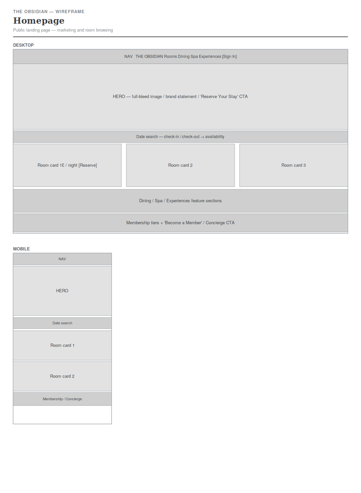

### Login & Register
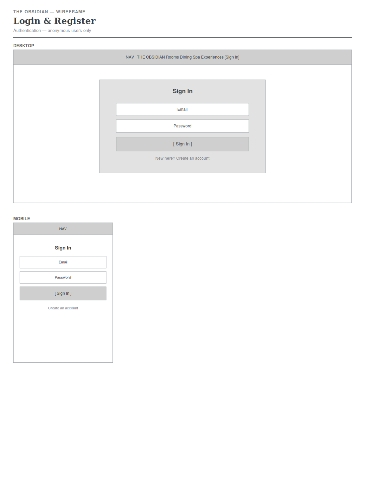

### Booking — Search Dates
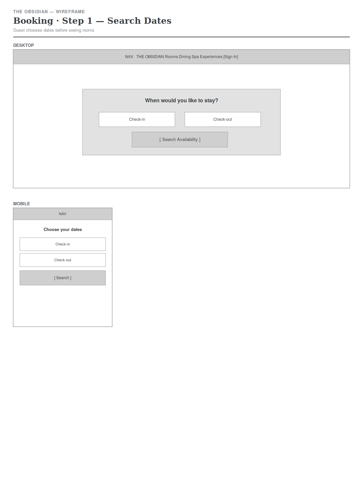

### Booking — Room Gallery
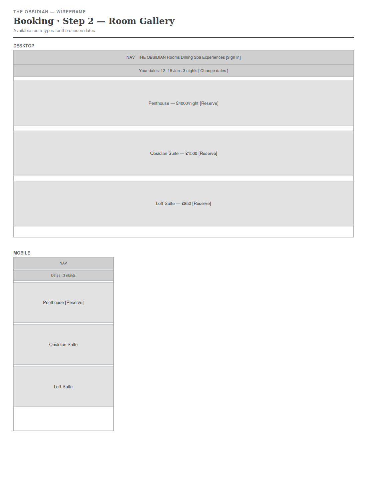

### Booking — Checkout
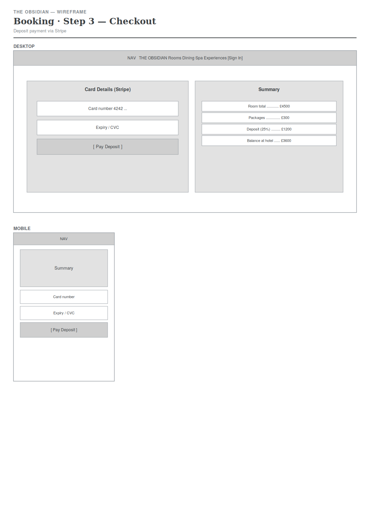

### Guest Dashboard
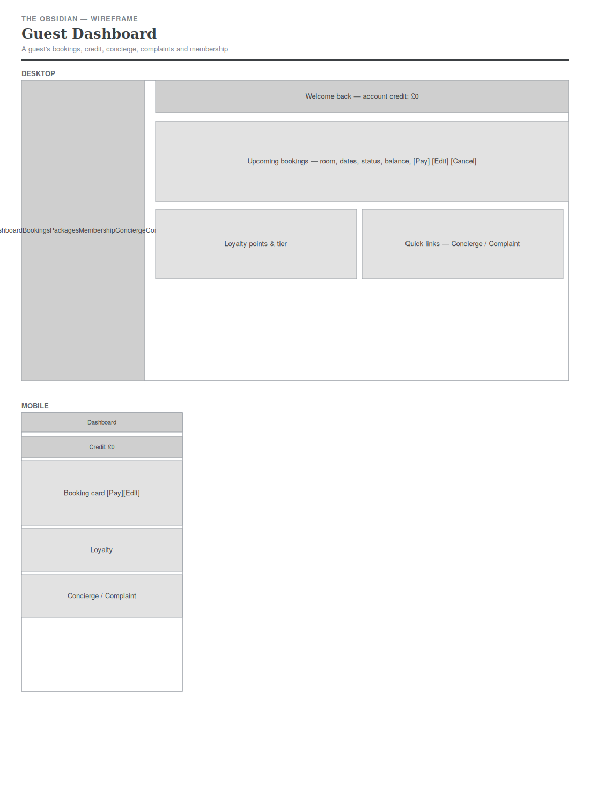

### Reception Dashboard
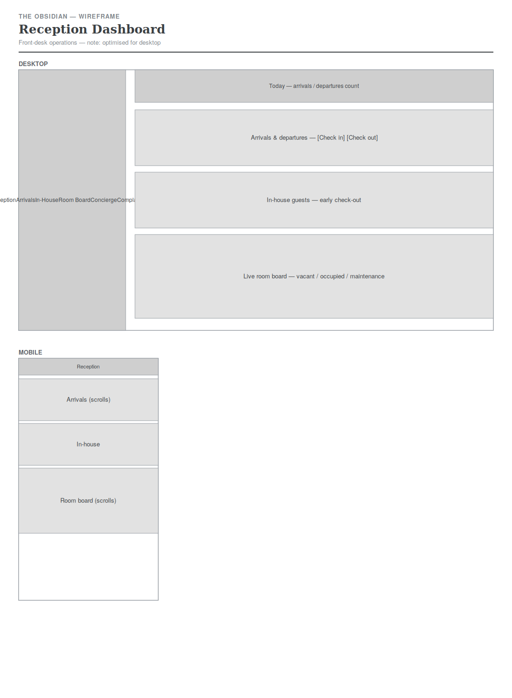

### Manager Dashboard
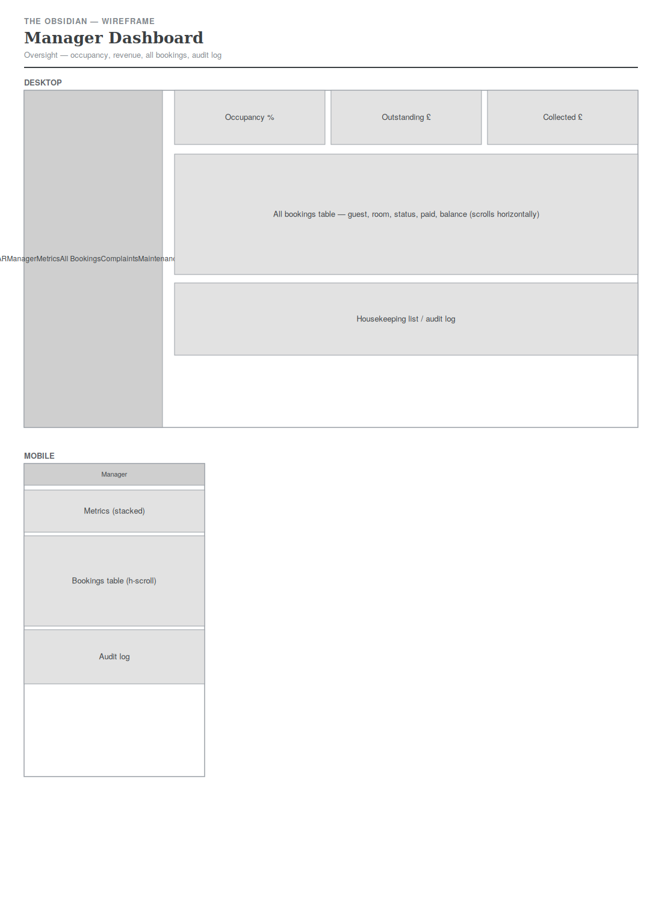

### Membership
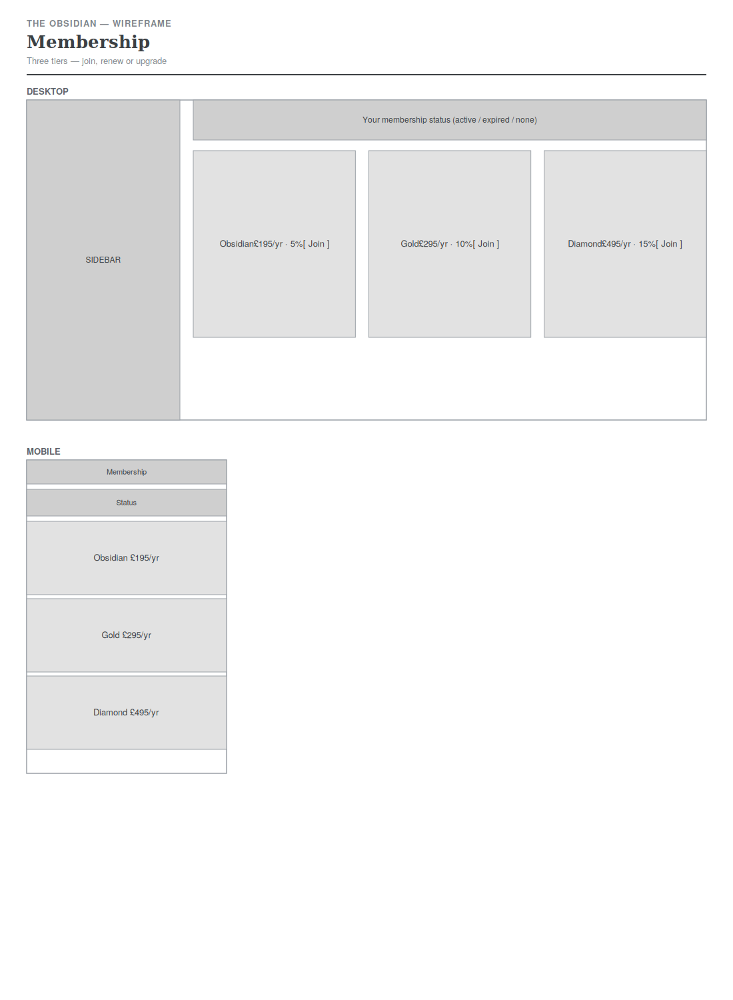

### Concierge
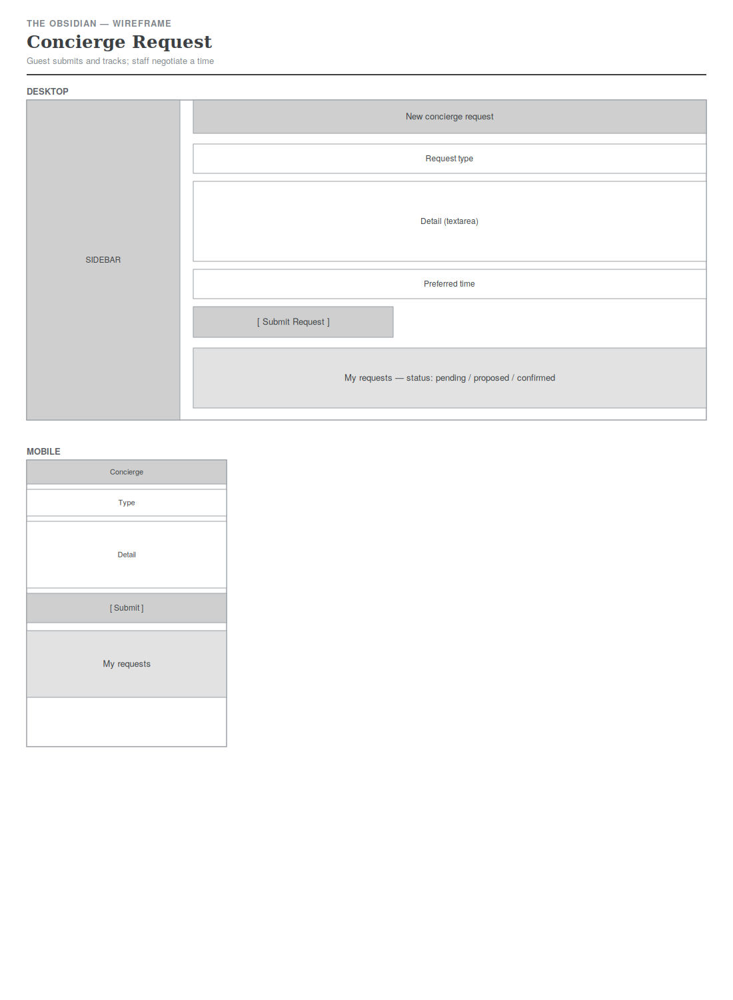

### Complaints
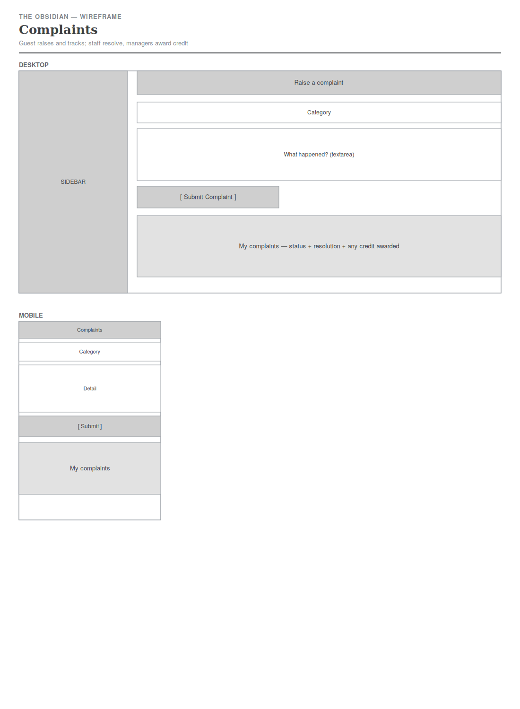

### Maintenance Board
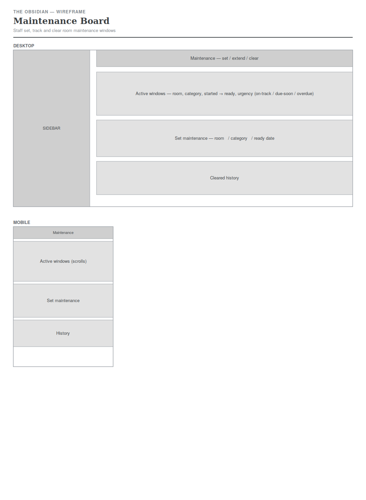

---

## 5. Database Design

### Entity Relationship Diagram

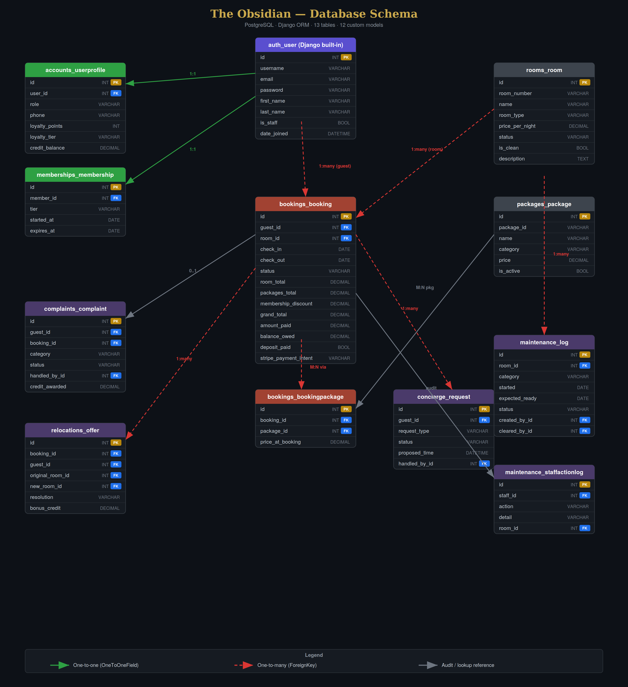

The diagram shows all thirteen tables (Django's built-in `auth_user` plus twelve custom models), their columns and types, primary and foreign keys, and the relationships between them. Header colour indicates each table's role: the built-in user table, the one-to-one extensions (profile, membership), the central booking transaction tables, the room and package lookups, and the audit and workflow tables.

### How the tables connect

The schema is built around the **Booking**, which ties together a guest, a room and any packages.

- **User → UserProfile** is **one-to-one**. Django's built-in `User` handles authentication; `UserProfile` extends it via a `user_id` foreign key pointing to `User.id`, adding the `role`, loyalty points and tier. A profile is created automatically by a signal whenever a user registers.
- **User → Booking** is **one-to-many**. Each booking stores a `guest_id` foreign key pointing to `User.id`; one user can hold many bookings.
- **Room → Booking** is **one-to-many**. Each booking stores a `room_id` foreign key pointing to `Room.id`; one room appears in many bookings over time.
- **Booking ↔ Package** is **many-to-many**, resolved through the **BookingPackage** join table. That table holds a `booking_id` and a `package_id` (two foreign keys) plus `price_at_booking`, so a booking can carry many packages, a package can appear on many bookings, and the price is frozen at the time of booking.
- **User → ConciergeRequest** is **one-to-many**, and `ConciergeRequest` actually holds two foreign keys to `User`: `guest_id` (who made the request) and `handled_by_id` (which staff member is handling it).

### Why availability is derived, not stored
A room is considered taken for a date range only when an active (non-cancelled, non-superseded) booking overlaps that range. This is computed at query time from the Booking table rather than stored on the Room. The benefit: editing or cancelling a booking instantly frees its dates for other guests, with no separate "release" step that could fall out of sync.

### The Models

**UserProfile** (`accounts`) — `role` (guest/receptionist/manager), `phone`, `loyalty_points`, `loyalty_tier`. One-to-one with User.

**Room** (`rooms`) — `room_number`, `name`, `room_type`, `floor`, `price_per_night`, `status`, `is_clean`, `notes`, `max_guests`.

**Package** (`packages`) — `package_id`, `name`, `category` (food/spa/occasion), `description`, `price`, `icon`, `is_active`.

**Booking** (`bookings`) — foreign keys to User and Room; many-to-many to Package through BookingPackage. Holds `check_in`, `check_out`, `guests_count`, `status`, `special_requests`, and the full money breakdown: `room_total`, `packages_total`, `grand_total`, `amount_paid`, `balance_owed`, `deposit_paid`, plus the Stripe payment reference.

**BookingPackage** (`bookings`) — join table holding `booking_id`, `package_id` and `price_at_booking`.

**ConciergeRequest** (`concierge`) — foreign keys to User (guest and handled_by); `request_type`, `detail`, `requested_time`, `proposed_time`, `confirmed_time`, `status`, `staff_notes`.

**RelocationOffer** (`relocations`) — foreign keys to Booking, User (guest), and Room (original and new); `resolution`, `status`, `bonus_credit`, `guest_choice`. Records how a booking disrupted by maintenance was resolved.

**MaintenanceLog** (`maintenance`) — foreign key to Room and to User (created_by and cleared_by); `category`, `started`, `expected_ready`, `status`. Defines the date-bounded window during which a room is out of service.

**StaffActionLog** (`maintenance`) — foreign keys to User (staff) and Room; `action`, `detail`, `created_at`. The audit trail attributing each consequential staff action.

**Complaint** (`complaints`) — foreign keys to User (guest and handled_by) and an optional Booking; `category`, `detail`, `status`, `resolution`, `credit_awarded`. A guest complaint and its handling state.

**Membership** (`memberships`) — one-to-one with User; `tier`, `started_at`, `expires_at`. Grants a room-rate discount while active.

---

## 6. Features

### Recent enhancements
- **Maintenance relocation & compensation.** When staff place a room under maintenance, any affected bookings are handled rather than orphaned. Same-type rooms and free upgrades are reassigned automatically; downgrades and fully booked dates are sent to the guest, who chooses to accept the alternative, take account credit, or reschedule — with a free-nights bonus (one night for short stays, two for long) added as credit when they are worse off. Staff can follow up from the reception and manager dashboards — pending offers show the guest's email for contact, and staff can record a decision a guest gives by phone or in person. The hotel never auto-cancels a booking. Implemented as a dedicated `relocations` app.
- **Room maintenance with date-bounded windows.** Staff place a room under maintenance by choosing a category (plumbing, electrical, broken furniture, deep clean, minor, or major/structural), each with a realistic default resolution window that staff can adjust. Maintenance blocks only the dates it actually covers — the room stays bookable for later dates and frees automatically once the window passes, rather than being locked until someone clears it. A maintenance board shows each job with a three-level urgency indicator (on track, due soon, overdue) so staff act before a window runs out, and staff can extend a window if a repair overruns (which re-checks for affected bookings and routes them to relocation). Implemented as a dedicated `maintenance` app.
- **Staff accountability audit trail.** Every consequential staff action — check-in, check-out, cleaning, setting/extending/clearing maintenance, and recording a guest's relocation decision — is written to an audit log attributing it to the staff member and time. Managers see the full audit log; receptionists do not. Because staff sign in with their own accounts, the attribution is genuine.
- **Guest complaints with staff workflow.** Guests raise complaints (category, detail, optional booking) and track their status and resolution from their dashboard. Staff move complaints from open through in-progress to resolved; managers may award account credit as compensation on resolution, which is added to the guest's balance. Reception and managers both see the queue; only managers can award credit. Implemented as a dedicated `complaints` app.
- **Annual membership with booking discounts.** Guests can join one of three tiers (Obsidian 5%, Gold 10%, Diamond 15% off room rates) for a one-off yearly payment (paid by card via Stripe) that does not auto-renew. Benefits apply to bookings while the membership is active and stop automatically at expiry (computed on access) until the guest manually renews. Active members may upgrade to a higher tier for a prorated difference (paid by card, rounded up, minimum £1), keeping their original expiry; they cannot repurchase the same or a lower tier while active. The discount applies on top of any account credit. Implemented as a dedicated `memberships` app.
- **In-house guest relocation for maintenance.** When staff place a room under maintenance that has a checked-in guest, the system flags the in-house guest and offers the best alternative room (same type, then upgrade, then downgrade). Staff confirm the move — which updates room occupancy immediately — or, for a serious fault or at the guest's request, instead issue a refund of what was paid as account credit plus a goodwill bonus.
- **Early check-out by staff.** Reception can check out any in-house guest before their booked departure date from an in-house guests panel, settling the balance and releasing the room for housekeeping.
- **Robust credit and deposit handling.** Account credit can be applied against a booking's full balance, not only the deposit. A booking already covered by credit or payment is marked secured or paid in full and shows no payment prompt, and the checkout flow never sends a zero amount to the payment provider. When credit covers a booking, a prominent confirmation makes clear that no card payment is needed.

**Known limitation and future enhancements:** the application is request-driven with no background job runner, so time-based states (maintenance urgency levels, the release of abandoned unpaid bookings) are computed when a staff member next loads the relevant page rather than pushed proactively. As a result the system cannot send automatic email reminders (for example, alerting a manager that a maintenance window is overdue) without someone being on the site. Future enhancements would add scheduled email reminders and notifications (via a task runner such as Celery, or the host's cron feature), guest-facing email confirmations, the ability to buy or gift account credit, and complimentary transport as a relocation compensation option.
- **Bookings are confirmed only after payment.** A new booking is held as *pending payment* and is not confirmed (and does not permanently hold the room) until the deposit is paid. Abandoned checkouts are released automatically, so closing the payment tab never locks a room indefinitely.
- **Pay Deposit from the dashboard.** Any booking still awaiting its deposit shows a clear "Awaiting deposit" label and a Pay Deposit button.
- **Account credit.** If a guest edits a booking down to a cheaper total after paying, the surplus becomes account credit (never a negative balance) and is applied automatically to their next booking. Cash back is handled in person at the front desk — no automatic refund is issued.
- **Live availability when editing.** The edit page shows how many rooms of the chosen type are free for the chosen dates, updating live as the guest changes type or dates.
- **Staff room management.** Receptionists and managers can check guests in and out, mark rooms clean or needing cleaning, and place rooms under maintenance — all from the dashboard, all role-protected.


### Guest features
- **Dates-first booking** — search by dates, then a gallery of room types showing live availability ("4 of 6 available", "Only 1 left", or a greyed-out "Fully booked"), with a suggested alternative when a type is full.
- **Package pre-ordering** with a live running total as packages are selected.
- **Stripe deposit payment** (25%) with success and failure feedback.
- **Full booking edit** — change dates, guests, packages or room type. Same-type edits update the record in place; a room-type change is handled as a new booking, with the old one superseded (freeing its dates) and the amount already paid carried across.
- **Top-up payments** — if an edit raises the total, the guest pays only the difference; if it lowers the total, the surplus reduces the balance owed.
- **Full payment transparency** — every booking shows grand total, deposit, amount paid and balance owed.
- **Cancellation** that frees the dates immediately.
- **Concierge requests** with a negotiation flow — the guest proposes a time, staff accept or propose an alternative, and the guest confirms or counters.
- **Diamond Circle loyalty points**, earned per pound spent, with tier progression.

### Receptionist features
- Today's arrivals and departures, each with the balance to collect.
- Live room status board, colour-coded by status.
- Concierge request management (accept the guest's time or propose another).

### Manager features
- Occupancy percentage, collected revenue and the **aggregate outstanding balance** across all active bookings.
- The full bookings table with total, paid and owed columns.
- A housekeeping list of rooms needing attention.
- Everything the receptionist can see.

### CRUD summary (criterion 2.4)
- **Create** — bookings, concierge requests, user accounts.
- **Read** — guests read their bookings; staff read arrivals, the room board and all bookings.
- **Update** — guests edit bookings; staff update concierge status; the room board reflects changes immediately.
- **Delete** — guests cancel bookings (a soft delete that frees the dates and preserves the record for reporting).

---

## 7. Django Templates

The project follows Django's Model-View-Template pattern, with logic placed in the component best suited to it (criterion M(vi)):

- **Data logic lives in the models** — `Booking.calculate_totals()`, `deposit_amount()`, `top_up_due()` and `apply_payment()` keep money calculations with the data they describe.
- **Domain logic lives in a utility module** — date-overlap availability and room-type counting sit in `rooms/utils.py`, importable by any view.
- **Business logic lives in the views** — the booking flow, edit/supersede decisions and payment routing are in `bookings/views.py`.
- **Presentation lives in the templates** — no business logic in templates beyond display loops and conditionals.

Template inheritance keeps the markup DRY:
- `base.html` — the public site shell: nav, mobile menu, footer, font and CSS links.
- `portal_base.html` — the logged-in shell: top bar, sidebar block, messages framework.
- Every page extends one of these and fills named blocks (`content`, `main`, `sidebar`, `extra_js`).

Named URLs are used throughout via `` tags, and static assets via ``, so no paths are hard-coded.

---

## 8. Security

- **Secrets in environment variables** — `SECRET_KEY`, Stripe keys, `DEBUG` and `ALLOWED_HOSTS` are read via `python-decouple` from a `.env` file that is listed in `.gitignore` and never committed. An `.env.example` documents the required variables without exposing values.
- **DEBUG off in production** — controlled by the `DEBUG` environment variable.
- **Authentication via django-allauth** — registration and login are handled by allauth, not custom code. The reason to register is stated clearly on both the login and signup pages (to book and manage reservations and access the Diamond Circle).
- **Anonymous-only auth pages** — allauth redirects already-authenticated users away from the login and registration pages.
- **Role-based access control** — a custom `@role_required` decorator (`accounts/decorators.py`) guards the reception and manager dashboards and the concierge management view. A guest who tries to reach a staff URL is redirected; the data store is never reachable except through permission-checked views. Managers bypass lower gates by design.
- **Ownership checks** — guests can only view and edit their own bookings; every booking view filters by the logged-in user, so one user can never access or edit another's data.
- **CSRF protection** — Django's CSRF middleware is active and every form includes ``.

---

## 9. Testing

### 9.1 Testing Plan and Strategy

Testing followed a two-track strategy running alongside development. Automated unit and integration tests were written for the business logic — the money model, availability engine, permission rules, and the state machines behind relocations, complaints and memberships — so that core behaviour could be verified repeatedly and regressions caught immediately as new features were added. Manual testing then covered the full user journey across all three roles, confirming functionality, usability and accessibility in a real browser on both desktop and mobile widths.

The plan was structured around four questions, mapped to the assessment's testing requirement (assess functionality, usability, responsiveness and data management):

| Dimension | Question | How it was tested |
|---|---|---|
| **Functionality** | Does every feature do what it should? | Automated tests for logic; manual click-through of every button, form and link |
| **Usability** | Is the application intuitive and is the user always informed? | Manual testing of feedback messages, navigation, empty states and error prompts |
| **Accessibility** | Can the application be used by everyone, including keyboard and screen-reader users? | Manual checks of semantic markup, contrast, focus order, alt text and form labels |
| **Data management** | Is data stored, related and updated correctly? | Automated tests of CRUD, relationships and derived values; manual verification in the admin |

The order of work was: write a failing test for a piece of logic, implement until it passed, then manually verify the surrounding interface. Every automated test below currently passes, and every manual test case was re-run against the deployed build.

### 9.2 Automated Testing

The project includes **50 automated tests** across eight apps, written with Django's built-in `TestCase`. They are run with:

```bash
python manage.py test
```

All 50 pass with no failures or errors.

| App | Tests | Area covered |
|---|---|---|
| `accounts` | 3 | Profile auto-creation on registration, loyalty-tier thresholds, staff-role helper |
| `rooms` | 6 | Room model defaults and string, and the availability engine — maintenance rooms excluded, rooms freed after a maintenance window, vacant rooms available, and the homepage type summary |
| `bookings` | 11 | The full money model — totals and balance, 25% deposit, payment application, top-up after an increase, balance never negative, overpayment to credit, pending-payment default, fully-paid bookings needing no charge, and the credit add/use methods |
| `concierge` | 4 | Request validation, the propose-then-confirm negotiation flow, and that guests cannot reach the staff management view |
| `relocations` | 8 | Free-night sizing for short and long stays, best-room search (same-type and downgrade), the credit refund (paid plus bonus), staff decision recording, and the in-house downgrade auto-move with compensation |
| `maintenance` | 8 | Category-based ready dates, three-level urgency escalation, date-bounded blocking, audit logging, and that only managers can view the audit log |
| `complaints` | 5 | Detail validation, and the role rule that only managers — not receptionists — may award account credit on resolution |
| `memberships` | 5 | Tier discounts while active, no discount once expired, the prorated upgrade cost, the same/lower-tier block, and the £1 minimum upgrade charge |

#### Representative test cases

| Test | What it asserts | Why it matters |
|---|---|---|
| `test_deposit_is_quarter` | A booking's deposit equals 25% of the grand total | The deposit drives the entire checkout amount |
| `test_overpayment_returned_for_credit` | Editing a booking down converts the surplus to account credit, not a negative balance | Prevents the money model going negative |
| `test_balance_never_negative` | The balance owed is floored at zero | Stops a zero or negative amount reaching Stripe |
| `test_maintenance_room_not_available` | A room under maintenance is excluded for dates inside its window | Core to the availability engine |
| `test_room_free_after_maintenance_window` | The same room is available again for dates after the window | Maintenance is date-bounded, not permanent |
| `test_in_house_downgrade_moves_and_compensates` | A checked-in guest with only a cheaper room free is moved and credited | Verifies the relocation priority and compensation |
| `test_manager_awards_credit` / `test_receptionist_cannot_award_credit` | Only a manager's complaint resolution adds credit | Enforces the role-based money permission |
| `test_expired_membership_gives_no_discount` | An expired membership returns a zero discount | Benefits must stop at expiry |
| `test_upgrade_minimum_one_pound` | A near-expired upgrade still costs at least £1 | Avoids a zero charge being sent to Stripe |
| `test_guest_cannot_manage` / `test_guest_cannot_see_queue` | Guests are blocked from staff views | Confirms access control |

### 9.3 Manual Testing — Functionality

Every interactive element was exercised by hand. The tables below list each button, form and link, the steps taken, the expected result and the outcome.

#### Public site and navigation

| # | Element / Action | Steps | Expected | Result |
|---|---|---|---|---|
| F1 | Homepage load | Visit `/` as an anonymous visitor | Page loads with live room-type availability | Pass |
| F2 | Primary nav links | Click each header link (Home, Rooms, Packages, Sign In) | Each routes to the correct page | Pass |
| F3 | Homepage date search | Enter check-in and check-out, submit | Redirects to the rooms page filtered to those dates | Pass |
| F4 | Date guard (home) | Set check-out on or before check-in | Check-out auto-corrects to the day after check-in | Pass |
| F5 | "Become a Member" button (anon) | Click while logged out | Routes to sign-in, then on to membership | Pass |
| F6 | "Submit a Request" button (anon) | Click the concierge button while logged out | Routes to sign-in first | Pass |
| F7 | Reservation search (lower form) | Enter dates, click Check Availability | Real search to the rooms page (no dummy submit) | Pass |
| F8 | Footer / external links | Click any external link | Opens in a new tab | Pass |
| F9 | Non-existent page | Visit an unknown URL | Handled without breaking the site | Pass |

#### Authentication

| # | Element / Action | Steps | Expected | Result |
|---|---|---|---|---|
| F10 | Register | Complete the sign-up form | Account and profile created, logged in | Pass |
| F11 | Register validation | Submit with mismatched or weak password | Rejected with a clear message | Pass |
| F12 | Login routing — guest | Log in as a guest | Lands on the guest dashboard | Pass |
| F13 | Login routing — reception | Log in as a receptionist | Lands on the reception dashboard | Pass |
| F14 | Login routing — manager | Log in as a manager | Lands on the manager dashboard | Pass |
| F15 | Auth-only pages | Visit `/dashboard/` while logged out | Redirected to login | Pass |
| F16 | Anonymous-only pages | Visit login while already logged in | Handled gracefully | Pass |
| F17 | Sign out | Click Sign Out | Branded confirmation page shown | Pass |
| F18 | Return to website | Click "Return to Website" after sign-out | Lands on the public homepage | Pass |

#### Rooms, packages and booking

| # | Element / Action | Steps | Expected | Result |
|---|---|---|---|---|
| F19 | Rooms grouped by type | Open the rooms page | Types shown as cards, not individual rooms | Pass |
| F20 | Availability — full | Book out a whole type, search those dates | Type shows "Fully booked" and is greyed out | Pass |
| F21 | Availability — last room | Leave one room of a type, search | Shows "Only 1 left" | Pass |
| F22 | Alternative suggestion | Choose a fully booked type | Nearest available type is suggested | Pass |
| F23 | Reserve (anon) | Click Reserve while logged out | Prompted to sign in | Pass |
| F24 | Create booking | Confirm a type, add packages | Booking created with correct totals | Pass |
| F25 | Booking validation | Set check-out before check-in | Rejected with a message | Pass |
| F26 | Packages add-on | Add one or more packages | Package totals added to the grand total | Pass |
| F27 | Edit booking (same type) | Change the dates | Record updated, totals recalculated | Pass |
| F28 | Edit booking (new type) | Change the room type | Old booking superseded, dates freed, new one made | Pass |
| F29 | Cancel booking | Cancel an active booking | Dates freed, booking dimmed with a stamp | Pass |

#### Payments (Stripe test mode)

| # | Element / Action | Steps | Expected | Result |
|---|---|---|---|---|
| F30 | Pay deposit | Pay with card 4242 4242 4242 4242 | Success page, deposit recorded, balance reduced | Pass |
| F31 | Declined card | Pay with 4000 0000 0000 0002 | Failure reported with a helpful message | Pass |
| F32 | Credit covers deposit | Apply credit that covers the deposit | Confirmation banner; no card charge needed | Pass |
| F33 | Credit covers full balance | Apply credit covering the whole booking | Marked paid in full; no pay button shown | Pass |
| F34 | No zero charge | Open checkout on a fully covered booking | Redirects to success; nothing sent to Stripe | Pass |
| F35 | Top-up | Edit a booking to a higher total | Charged only the difference | Pass |
| F36 | Edit lower | Edit to a cheaper total | Surplus reduces the balance / returns as credit | Pass |

#### Concierge

| # | Element / Action | Steps | Expected | Result |
|---|---|---|---|---|
| F37 | Submit request | Raise a concierge request as a guest | Request created and listed under My Requests | Pass |
| F38 | Staff propose | As staff, propose a time | Guest sees the proposed time | Pass |
| F39 | Guest confirm / counter | Confirm or counter the proposal | State transitions correctly | Pass |
| F40 | Complete | Staff mark the request complete | Status updates and closes | Pass |
| F41 | Access control | Guest opens the staff manage URL | Blocked | Pass |

#### Dashboards and staff actions

| # | Element / Action | Steps | Expected | Result |
|---|---|---|---|---|
| F42 | Check-in | Reception checks a guest in | Booking and room status update | Pass |
| F43 | Early check-out | Reception checks a guest out before departure | Balance settled, room released | Pass |
| F44 | Cleaning toggle | Mark a room cleaned | Room cleanliness updates | Pass |
| F45 | Manager outstanding total | Open the manager dashboard | Total outstanding balance shown | Pass |
| F46 | Role protection | Receptionist visits the manager dashboard | Redirected away | Pass |
| F47 | Ownership | Guest opens another guest's booking URL | Blocked / 404 | Pass |

#### Maintenance and relocation

| # | Element / Action | Steps | Expected | Result |
|---|---|---|---|---|
| F48 | Set maintenance | Place a room under maintenance | Room blocked for the window; board shows urgency | Pass |
| F49 | Maintenance frees later dates | Search dates after the window | Room available again | Pass |
| F50 | Relocate future booking | Maintenance hits a future booking | Same/upgrade auto-applied; downgrade offered with compensation | Pass |
| F51 | Relocate in-house — move | Maintenance on a checked-in guest's room, choose move | Guest moved, occupancy updated | Pass |
| F52 | Relocate in-house — downgrade | Only a cheaper room free | Guest moved and credited the difference plus bonus | Pass |
| F53 | Relocate in-house — credit | No room free, or staff override | Refund plus bonus to credit | Pass |
| F54 | Audit log (manager) | Open the audit log as a manager | Full staff action history shown | Pass |
| F55 | Audit log (reception) | Try to open the audit log as reception | Blocked | Pass |

#### Complaints

| # | Element / Action | Steps | Expected | Result |
|---|---|---|---|---|
| F56 | Raise complaint | Submit a complaint as a guest | Logged and tracked under My Complaints | Pass |
| F57 | Complaint validation | Submit with too little detail | Rejected with a message | Pass |
| F58 | Staff progress | Reception marks it in progress | Status updates | Pass |
| F59 | Receptionist resolve | Reception resolves, enters a credit amount | Resolved, but no credit awarded | Pass |
| F60 | Manager credit | Manager resolves with a credit amount | Credit added to the guest's balance | Pass |
| F61 | Guest sees resolution | Guest reopens My Complaints | Status, resolution and any credit shown | Pass |

#### Membership

| # | Element / Action | Steps | Expected | Result |
|---|---|---|---|---|
| F62 | View tiers | Open the membership page | Three tiers with prices and discounts | Pass |
| F63 | Join (Stripe) | Join a tier and pay with the test card | Membership activates for one year | Pass |
| F64 | Discount applies | Make a booking while active | Room rate reduced by the tier discount | Pass |
| F65 | Block lower/same | Try to buy a same or lower tier while active | Blocked; only upgrade offered | Pass |
| F66 | Upgrade (prorated) | Upgrade to a higher tier | Prorated difference charged; expiry unchanged | Pass |
| F67 | Expiry stops discount | Set expiry to the past, make a booking | No discount; renew prompt shown | Pass |
| F68 | Renew | Renew an expired membership | Reactivated for a fresh year | Pass |

### 9.4 Manual Testing — Usability

| # | Aspect | Check | Result |
|---|---|---|---|
| U1 | Feedback | Every create, edit, cancel, pay and resolve action shows a flash message | Pass |
| U2 | Empty states | Empty lists (no bookings, no complaints, no requests) show a friendly message, not a blank page | Pass |
| U3 | Error prompts | Invalid form input is reported next to the field with a clear reason | Pass |
| U4 | No data re-entry | Logged-in users are never asked for information the application already holds | Pass |
| U5 | Progress clarity | The booking flow shows where the user is and what is left to pay | Pass |
| U6 | Active navigation | The current section is indicated in the navigation | Pass |
| U7 | Confirmation | Destructive actions (cancel, place under maintenance) are confirmed before they run | Pass |
| U8 | Consistency | Buttons, cards, badges and forms look and behave the same across every page | Pass |
| U9 | Payment clarity | When credit covers a booking, the interface states plainly that no card payment is due | Pass |
| U10 | Reading flow | Money is always shown as a clear breakdown (room, packages, discount, deposit, balance) | Pass |

### 9.5 Manual Testing — Accessibility

| # | Aspect | Check | Result |
|---|---|---|---|
| A1 | Semantic markup | Headings, landmarks, lists and tables use correct elements | Pass |
| A2 | Form labels | Every input has an associated label | Pass |
| A3 | Keyboard navigation | All links, buttons and forms are reachable and operable by keyboard | Pass |
| A4 | Focus order | Tab order follows the visual reading order | Pass |
| A5 | Colour contrast | Gold-on-black and cream-on-black text meet contrast guidance | Pass |
| A6 | Alt text | Meaningful images carry descriptive alt text; decorative ones are marked empty | Pass |
| A7 | No colour-only meaning | Status is shown with text labels as well as colour | Pass |
| A8 | Responsive reflow | At mobile width nothing overflows; tables scroll within their container | Pass |
| A9 | No autoplay | No audio or video plays automatically | Pass |
| A10 | Error redirection | A user reaching an invalid page is returned to the site without using the back button | Pass |

### 9.6 Responsiveness

The application was tested at desktop, tablet and mobile widths using browser developer tools and a physical device. Both layout shells (public and portal) carry overflow guards at the 600px and 380px breakpoints. The navigation, room and package cards, dashboards, booking flow, and the manager's wide data tables were each confirmed to reflow correctly, with horizontal scrolling contained inside table wrappers rather than pushing the whole page sideways.

### 9.7 Test-Driven Approach

The money model and availability engine were built test-first: a failing test described the intended behaviour, the logic was implemented until it passed, and the test then guarded against regressions as later features were added. The version control history records each feature and fix as a separate, described commit, providing a record of the development process.

---
## 10. Validation

> **Note:** Run these validators against your deployed site and paste the results/screenshots below before submission.

### HTML — [W3C Validator](https://validator.w3.org/)
| Page | Result | Notes |
|------|--------|-------|
| Homepage | _to run_ | |
| Login | _to run_ | |
| Booking gallery | _to run_ | |
| Guest dashboard | _to run_ | |

### CSS — [W3C Jigsaw Validator](https://jigsaw.w3.org/css-validator/)
| File | Result | Notes |
|------|--------|-------|
| `main.css` | _to run_ | |
| `portal.css` | _to run_ | |

### JavaScript — [JSHint](https://jshint.com/)
| File | Result | Notes |
|------|--------|-------|
| `main.js` | _to run_ | |
| `booking.js` | _to run_ | |
| `checkout.js` | _to run_ | |

### Python — PEP8 ([CI Python Linter](https://pep8ci.herokuapp.com/))
| File | Result | Notes |
|------|--------|-------|
| `bookings/views.py` | _to run_ | Written to PEP8; comments before each block |
| `bookings/models.py` | _to run_ | |
| `rooms/utils.py` | _to run_ | |
| `accounts/decorators.py` | _to run_ | |

All Python was written to follow the PEP8 style guide: four-space indentation, descriptive snake_case names, no lines of dead code, and a clear comment before each logic block.

---

## 11. Bugs and Fixes

Bugs found during development were diagnosed, fixed and — where they concerned logic — covered by a regression test so they could not return. The most significant are documented below with their cause and resolution.

### 11.1 Zero-amount Stripe charge on a credit-covered booking

**Symptom:** Paying for a booking already fully covered by account credit raised a Stripe `InvalidRequestError` ("amount must be at least 1") and the checkout crashed.

**Cause:** The checkout view always created a PaymentIntent for the deposit, even when credit or an earlier payment had already met it, sending an amount of zero to Stripe — which rejects any charge below one penny.

**Fix:** Payment state was made explicit on the model with `needs_payment()`, `amount_due_now()` and `is_fully_paid()`, each flooring at zero. The "Pay Deposit" button now appears only when `needs_payment()` is true, and a fully-covered booking visiting the checkout URL is redirected straight to the success page without ever calling Stripe. A confirmation banner makes clear when credit covers the booking and no card payment is required. Covered by `test_amount_due_now_never_negative`, `test_fully_paid_booking_needs_no_payment` and `test_balance_never_negative`.

### 11.2 Negative balance when editing a booking to a cheaper room

**Symptom:** Editing a paid booking down to a cheaper room produced a negative balance owed, implying the hotel owed money mid-booking.

**Cause:** The balance was calculated as `grand_total - amount_paid` with no floor, so an overpayment relative to the new, lower total went negative.

**Fix:** `calculate_totals()` now floors the balance with `max(grand_total - amount_paid, 0)` and **returns the overpayment**, which the view moves to the guest's account credit. The surplus becomes spendable credit rather than a negative number. Covered by `test_overpayment_returned_for_credit` and `test_balance_never_negative`.

### 11.3 Multi-line Django template comments leaking to the page

**Symptom:** Stray explanatory text appeared rendered on several pages.

**Cause:** Django's `{# ... #}` comment syntax is single-line only. Comments written across two lines left the second line outside the comment, so it rendered as visible page content.

**Fix:** Every template comment was reduced to a single line. A scan (`awk '/\{#/ && !/#\}/'`) was added to the review process and run after each change to catch any recurrence. All templates are now clean.

### 11.4 Mobile horizontal overflow

**Symptom:** On narrow screens the page could be scrolled sideways, and the manager's wide booking table pushed the whole layout out of alignment.

**Cause:** Long room names and fixed-width tables exceeded the viewport with no constraint.

**Fix:** Overflow guards were added at the 600px and 380px breakpoints in both stylesheets, and wide tables were wrapped in a container that scrolls internally, so horizontal scrolling is contained to the table rather than the page. Verified manually across the homepage, rooms, dashboards and booking flow.

### 11.5 Non-functional homepage forms

**Symptom:** The homepage concierge form and a second "Reservations" form looked interactive but did nothing — the concierge fields did not save or carry through login, and the reservation button only showed a toast.

**Cause:** Both were static mock-ups left from the original front-end with no backing view.

**Fix:** The concierge form was reduced to a single call-to-action button that routes a signed-in user to the real request form, or an anonymous user to sign-in first. The reservation form was converted into a real search that submits dates to the rooms availability page. The dead client-side handler was removed and the date-syncing logic consolidated into one external script handling both date-input pairs.

### 11.6 Stale membership appearing on a fresh account

**Symptom:** During testing a guest account appeared to hold a membership it had not bought, and the page seemed to allow buying a lower tier.

**Cause:** This was traced to **test data left in the local database**, not a code fault — the join/upgrade rules correctly block same and lower tiers and the page does reflect an active membership. The seed command deliberately does not create memberships.

**Fix:** No code change was required; the resolution is to clear the leftover record (delete the local database and reseed, or remove it in the admin). The investigation confirmed the tier rules and expiry logic behave correctly, and these are protected by `test_cannot_upgrade_to_same_or_lower` and `test_expired_membership_gives_no_discount`.

### 11.7 Missing required environment variable on first deploy

**Symptom:** The first cloud deployment failed during the release step with `decouple.UndefinedValueError: STRIPE_WEBHOOK_SECRET not found`.

**Cause:** `settings.py` reads every secret from the environment via `python-decouple`. The webhook secret had not yet been set on the host, so configuration loading raised before the app could start.

**Fix:** The variable was added to the host's environment alongside the other secrets. The deployment section documents the full required set so a clean deploy has every variable in place.

### 11.8 Known limitations and future work

The items below are known and understood. Some are infrastructural limitations that were out of scope for this build; others are minor bugs identified late that there was not time to resolve before submission. They are documented here honestly rather than hidden.

**Limitations (by design or infrastructure)**

- **No background processing when no user is present.** The application is request-driven: it has no scheduled task runner or background worker. Time-based states — such as maintenance urgency levels, and the release of abandoned unpaid bookings after their hold window — are only recalculated when a user next loads the relevant page, not proactively in the background. Nothing updates while the site is idle and unattended. A production version would add a task runner (such as Celery with a scheduler, or the host's cron feature) to push these updates and send time-based notifications without anyone being on the site.

- **The application sends no email.** No email backend is configured, and account registration completes without an email confirmation step (`ACCOUNT_EMAIL_VERIFICATION = 'none'`). This means there is currently no email of any kind: no sign-up verification, no booking confirmation, no payment receipt, no concierge or complaint status update, and no membership receipt. The reason is infrastructural — sending mail requires a transactional email service (such as SendGrid, Mailgun or an SMTP provider) with credentials stored as environment variables, which there was not time to configure before submission. Turning email verification on without that backend in place would block registration entirely, because the confirmation email would have nowhere to send from. The registration, booking, payment, concierge, complaint and membership flows all work in the application itself; only the outbound email layer is absent. Future work would configure an email provider and add a verification link on sign-up plus confirmation emails on booking, deposit payment, concierge updates, complaint resolution and membership purchase.

- **Optimised primarily for guests on mobile.** The design and responsive testing focused on the guest-facing experience on mobile devices, since guests are the primary audience and most likely to book from a phone. The staff and manager dashboards are functional but were built and tested mainly at desktop width; their wide data tables and management tools are not as fully refined for small screens as the guest journey. Future work would give the staff and manager interfaces the same level of mobile polish.

- The Stripe **webhook** endpoint is present but requires a public URL and a real signing secret to fire; in test mode the browser-side confirmation handles the success path, which both the deposit and membership flows follow. The robust production approach is to verify each payment via the webhook.

**Known bugs (identified late, not fixed before submission)**

- **Decorative buttons on the public homepage.** Several buttons in the homepage marketing sections — for example the dining "View Menu", "Reservations", "Book a Table" and "Order Now" links, and some "Book Now" buttons — are placeholders that do not yet lead anywhere. They illustrate the luxury-hotel concept rather than linking to working features, and there was not time to either wire them to real pages or remove them before submission. The core booking, membership, concierge and complaint journeys are reached through the working navigation and calls to action, not these decorative links.

- **"Sign In to Request" routing.** On the homepage concierge section, an anonymous user who clicks "Sign In to Request" is taken through sign-in but, after logging in, is directed to their dashboard rather than straight on to the concierge request form, and any intent from the homepage is not carried across. Signed-in users reach the concierge form directly. The request itself is created correctly once the form is submitted; only the post-login redirect to that form is not yet wired up. This was identified late and there was not time to resolve it before submission.

- **Membership has no enforced paywall on the deployed build.** The membership join and upgrade flow is built to take a Stripe card payment before activating, but on the submitted build the payment step is not reliably enforcing before the membership becomes active. There was not time to fully resolve and re-verify the membership payment gate before submission. Account credit is correctly excluded from buying membership, and the tier, discount, expiry and prorated-upgrade logic all work; the outstanding issue is solely the enforcement of the card payment step.


---
## 12. Deployment

### Local Development
```bash
git clone <repo-url>
cd obsidian-hotel
python3.13 -m venv venv
source venv/bin/activate          # Windows: venv\Scripts\activate
pip install -r requirements.txt
cp .env.example .env              # then fill in your own values
python manage.py migrate
python manage.py seed_data        # loads 21 rooms and 12 packages
python manage.py seed_users       # creates the three demo accounts
python manage.py createsuperuser  # optional, for the admin panel
python manage.py runserver
```
Visit `http://127.0.0.1:8000/`.

### Stripe Setup
1. Create a free account at [stripe.com](https://stripe.com) and switch to **Test mode**.
2. Go to **Developers → API keys** and copy the publishable (`pk_test_…`) and secret (`sk_test_…`) keys.
3. Put them in your `.env` as `STRIPE_PUBLIC_KEY` and `STRIPE_SECRET_KEY`.
4. Test card: `4242 4242 4242 4242`, any future expiry, any CVC. To test a failed payment, use `4000 0000 0000 0002`.

### Production Deployment (Railway)

The application is configured for [Railway](https://railway.app), which provides PostgreSQL and runs the app with Gunicorn and WhiteNoise. The deployment was tested end-to-end with `DEBUG=False` to confirm the production server serves the application and static files correctly.

**1. Push the code to GitHub** (Railway deploys from a GitHub repository):
```bash
git init
git add .
git commit -m "Initial commit"
git branch -M main
git remote add origin https://github.com/<your-username>/<your-repo>.git
git push -u origin main
```
The `.env` file is git-ignored, so no secrets are committed.

**2. Create the project on Railway:** sign in with GitHub, then **New Project → Deploy from GitHub repo** and select the repository. Railway reads `railway.json`, the `Procfile` and `requirements.txt` and begins building.

**3. Add the database:** in the project, **New → Database → PostgreSQL**. Railway automatically creates a `DATABASE_URL` variable, which `settings.py` reads via `dj-database-url`.

**4. Generate a domain:** web service → **Settings → Networking → Generate Domain**, and copy the URL (e.g. `your-app.up.railway.app`).

**5. Set environment variables** on the web service under **Variables**:
   - `SECRET_KEY` — a new long random string
   - `DEBUG` — `False`
   - `ALLOWED_HOSTS` — your Railway domain
   - `CSRF_TRUSTED_ORIGINS` — `https://your-app.up.railway.app`
   - `STRIPE_PUBLIC_KEY`, `STRIPE_SECRET_KEY`, `STRIPE_WEBHOOK_SECRET`

   Generate a secret key locally with:
   ```bash
   python -c "from django.core.management.utils import get_random_secret_key; print(get_random_secret_key())"
   ```

**6. Deploy.** Railway redeploys automatically when variables change. The `release` command in the `Procfile` runs `migrate` and `collectstatic` on every deploy.

**7. Seed the data once** via the service's run-a-command shell:
```bash
python manage.py seed_data
python manage.py seed_users
python manage.py createsuperuser
```

**8.** Visit the generated domain — the application is live.

**Stripe webhook (optional, for robust payments):** in the Stripe dashboard add a webhook endpoint at `https://your-app.up.railway.app/bookings/webhook/` and put its signing secret in `STRIPE_WEBHOOK_SECRET`.

### Production Deployment (Heroku alternative)
The project also runs on Heroku: create an app, add the Heroku Postgres add-on, set the same config vars as above, connect the GitHub repo and deploy the `main` branch. The `Procfile` runs migrations and `collectstatic` on release. Seed with `heroku run python manage.py seed_data` and `seed_users`.

### The Database
Development uses **SQLite** (zero configuration). Production uses **PostgreSQL** via the `DATABASE_URL` environment variable, read in a single place in `settings.py` through `dj-database-url`, so switching between them is a matter of one environment variable. Static files in production are served by **WhiteNoise**, with `collectstatic` run automatically on each deploy.

---

## 13. How to Use the Application

### As a Guest
1. Register or sign in.
2. Click **New Booking** and choose your dates and guest count.
3. Pick from the gallery of available room types.
4. Add any packages, then continue to payment.
5. Pay the deposit with a card.
6. From **My Bookings** you can edit or cancel, and see exactly what you have paid and still owe.
7. Use **Concierge** to make a bespoke request and agree a time.

### As a Receptionist
1. Sign in with the reception account.
2. The overview shows today's arrivals and departures with balances to collect.
3. Use the room board to see every room's status.
4. Handle concierge requests by accepting the guest's time or proposing another.

### As a Manager
1. Sign in with the manager account.
2. The dashboard shows occupancy, collected revenue and the total outstanding balance.
3. Review all bookings with full payment columns, and the housekeeping list.

### Demo Accounts
Run `python manage.py seed_users` to create:
- **Guest** — guest@obsidian.com / guest123
- **Receptionist** — reception@obsidian.com / staff123
- **Manager** — manager@obsidian.com / manager123

---

## 14. Technologies Used

**Languages:** Python, HTML5, CSS3, JavaScript

**Framework & libraries:**
- Django 6.0 — the full-stack framework
- django-allauth — authentication
- Stripe — payment processing
- python-decouple — environment variable management
- Pillow — image handling

**Database:** SQLite (development), PostgreSQL (production)

**Production serving:** Gunicorn, WhiteNoise, dj-database-url, psycopg2-binary

**Tools:** Git & GitHub (version control), Railway / Heroku (hosting), WhiteNoise (static file serving), Gunicorn (production server), Google Fonts (Cormorant Garamond, Montserrat)

---

## 15. Credits and Attributions

A clear comment precedes each logic block, and any line adapted from external documentation carries a comment noting its source. The tables below list the language features, framework features and techniques used, what each was used for in this project, and a link to the specific documentation consulted.

### 15.1 Python — General Techniques

| Technique | Where it is used | Documentation |
|---|---|---|
| `decimal.Decimal` | All monetary values (room rates, deposits, credit, discounts) use `Decimal` rather than float to avoid rounding errors | [docs.python.org/3/library/decimal.html](https://docs.python.org/3/library/decimal.html) |
| `datetime.date` / `timedelta` | Night counts, maintenance windows, membership expiry and date-overlap checks | [docs.python.org/3/library/datetime.html](https://docs.python.org/3/library/datetime.html#timedelta-objects) |
| `math.ceil` | Rounding the prorated membership upgrade cost up to the nearest whole pound | [docs.python.org/3/library/math.html#math.ceil](https://docs.python.org/3/library/math.html#math.ceil) |
| `functools.wraps` | Preserving the wrapped view's metadata inside the `role_required` decorator | [docs.python.org/3/library/functools.html#functools.wraps](https://docs.python.org/3/library/functools.html#functools.wraps) |
| `getattr()` with default | `getattr(self.guest, 'membership', None)` safely reads a relation that may not exist | [docs.python.org/3/library/functions.html#getattr](https://docs.python.org/3/library/functions.html#getattr) |
| `hasattr()` | Checking a user has a profile before reading its role | [docs.python.org/3/library/functions.html#hasattr](https://docs.python.org/3/library/functions.html#hasattr) |
| List comprehension | Building the list of available room types in the availability engine | [docs.python.org/3/tutorial/datastructures.html#list-comprehensions](https://docs.python.org/3/tutorial/datastructures.html#list-comprehensions) |
| Generator with `next()` | `next((rt for rt in types if ...), None)` finds the requested type or returns None | [docs.python.org/3/library/functions.html#next](https://docs.python.org/3/library/functions.html#next) |
| f-strings | Readable string interpolation in model `__str__` methods and messages | [docs.python.org/3/reference/lexical_analysis.html#f-strings](https://docs.python.org/3/reference/lexical_analysis.html#f-strings) |
| `@classmethod` | `Membership.price_for(tier)` reads tier pricing without an instance | [docs.python.org/3/library/functions.html#classmethod](https://docs.python.org/3/library/functions.html#classmethod) |
| `round()` | Rounding a calculated discount to two decimal places | [docs.python.org/3/library/functions.html#round](https://docs.python.org/3/library/functions.html#round) |
| `max()` / `min()` | Flooring a balance at zero and enforcing the £1 minimum upgrade | [docs.python.org/3/library/functions.html#max](https://docs.python.org/3/library/functions.html#max) |

### 15.2 Django — Models and the ORM

| Technique | Where it is used | Documentation |
|---|---|---|
| `models.Model` | Base class for all twelve custom models | [docs.djangoproject.com/en/stable/topics/db/models/](https://docs.djangoproject.com/en/stable/topics/db/models/) |
| `OneToOneField` | `UserProfile` and `Membership` each extend the built-in `User` | [docs.djangoproject.com/en/stable/ref/models/fields/#onetoonefield](https://docs.djangoproject.com/en/stable/ref/models/fields/#onetoonefield) |
| `ForeignKey` | Bookings link to guest, room; relocations, complaints and maintenance link to their related records | [docs.djangoproject.com/en/stable/ref/models/fields/#foreignkey](https://docs.djangoproject.com/en/stable/ref/models/fields/#foreignkey) |
| `ManyToManyField` | A booking can include many packages, and a package many bookings | [docs.djangoproject.com/en/stable/ref/models/fields/#manytomanyfield](https://docs.djangoproject.com/en/stable/ref/models/fields/#manytomanyfield) |
| `on_delete=CASCADE` | Removing a user removes their dependent records | [docs.djangoproject.com/en/stable/ref/models/fields/#django.db.models.CASCADE](https://docs.djangoproject.com/en/stable/ref/models/fields/#django.db.models.CASCADE) |
| `on_delete=PROTECT` | Prevents deleting a room that bookings still reference | [docs.djangoproject.com/en/stable/ref/models/fields/#django.db.models.PROTECT](https://docs.djangoproject.com/en/stable/ref/models/fields/#django.db.models.PROTECT) |
| `on_delete=SET_NULL` | Preserves an audit record if the related user is removed | [docs.djangoproject.com/en/stable/ref/models/fields/#django.db.models.SET_NULL](https://docs.djangoproject.com/en/stable/ref/models/fields/#django.db.models.SET_NULL) |
| `choices` | Role, room status, booking status, complaint and membership tiers | [docs.djangoproject.com/en/stable/ref/models/fields/#choices](https://docs.djangoproject.com/en/stable/ref/models/fields/#choices) |
| `DecimalField` | All money fields, matching the `Decimal` use in Python | [docs.djangoproject.com/en/stable/ref/models/fields/#decimalfield](https://docs.djangoproject.com/en/stable/ref/models/fields/#decimalfield) |
| `auto_now_add` / `auto_now` | Created and updated timestamps on bookings, complaints and logs | [docs.djangoproject.com/en/stable/ref/models/fields/#datefield](https://docs.djangoproject.com/en/stable/ref/models/fields/#django.db.models.DateField.auto_now_add) |
| Custom model methods | `calculate_totals()`, `is_active()`, `escalation()` hold business logic on the model | [docs.djangoproject.com/en/stable/topics/db/models/#model-methods](https://docs.djangoproject.com/en/stable/topics/db/models/#model-methods) |
| `get_FOO_display()` | Showing the human-readable label for a choices field | [docs.djangoproject.com/en/stable/ref/models/instances/#django.db.models.Model.get_FOO_display](https://docs.djangoproject.com/en/stable/ref/models/instances/#django.db.models.Model.get_FOO_display) |
| `Meta.ordering` | Default ordering of complaints and logs by newest first | [docs.djangoproject.com/en/stable/ref/models/options/#ordering](https://docs.djangoproject.com/en/stable/ref/models/options/#ordering) |

### 15.3 Django — Querying

| Technique | Where it is used | Documentation |
|---|---|---|
| `.filter()` / `.exclude()` | Throughout the availability engine and dashboards | [docs.djangoproject.com/en/stable/ref/models/querysets/#filter](https://docs.djangoproject.com/en/stable/ref/models/querysets/#filter) |
| `.exists()` | Date-overlap checks without fetching full objects | [docs.djangoproject.com/en/stable/ref/models/querysets/#exists](https://docs.djangoproject.com/en/stable/ref/models/querysets/#exists) |
| `status__in=[...]` | Filtering bookings by a set of statuses | [docs.djangoproject.com/en/stable/ref/models/querysets/#in](https://docs.djangoproject.com/en/stable/ref/models/querysets/#in) |
| Date range lookups | `check_in__lt` / `check_out__gt` implement the interval-overlap test | [docs.djangoproject.com/en/stable/ref/models/querysets/#range](https://docs.djangoproject.com/en/stable/ref/models/querysets/#gt) |
| `select_related()` | Single-JOIN fetch of a booking's room to avoid N+1 queries | [docs.djangoproject.com/en/stable/ref/models/querysets/#select-related](https://docs.djangoproject.com/en/stable/ref/models/querysets/#select-related) |
| `prefetch_related()` | Fetching each booking's many packages efficiently | [docs.djangoproject.com/en/stable/ref/models/querysets/#prefetch-related](https://docs.djangoproject.com/en/stable/ref/models/querysets/#prefetch-related) |
| `.aggregate()` with `Sum` | Manager dashboard's total outstanding balance and collected revenue | [docs.djangoproject.com/en/stable/topics/db/aggregation/](https://docs.djangoproject.com/en/stable/topics/db/aggregation/) |
| `.order_by()` | Ordering bookings and logs for display | [docs.djangoproject.com/en/stable/ref/models/querysets/#order-by](https://docs.djangoproject.com/en/stable/ref/models/querysets/#order-by) |

### 15.4 Django — Views, Forms, Auth and Templates

| Technique | Where it is used | Documentation |
|---|---|---|
| Function-based views | All views across the project | [docs.djangoproject.com/en/stable/topics/http/views/](https://docs.djangoproject.com/en/stable/topics/http/views/) |
| `render()` | Returning a template with context | [docs.djangoproject.com/en/stable/topics/http/shortcuts/#render](https://docs.djangoproject.com/en/stable/topics/http/shortcuts/#render) |
| `redirect()` | Post-action redirects to named URLs | [docs.djangoproject.com/en/stable/topics/http/shortcuts/#redirect](https://docs.djangoproject.com/en/stable/topics/http/shortcuts/#redirect) |
| `get_object_or_404` | Fetch-or-404 with ownership checks | [docs.djangoproject.com/en/stable/topics/http/shortcuts/#get-object-or-404](https://docs.djangoproject.com/en/stable/topics/http/shortcuts/#get-object-or-404) |
| `JsonResponse` | The live availability endpoint returns JSON | [docs.djangoproject.com/en/stable/ref/request-response/#jsonresponse-objects](https://docs.djangoproject.com/en/stable/ref/request-response/#jsonresponse-objects) |
| `@login_required` | Protecting all authenticated pages | [docs.djangoproject.com/en/stable/topics/auth/default/#the-login-required-decorator](https://docs.djangoproject.com/en/stable/topics/auth/default/#the-login-required-decorator) |
| Custom decorator | `role_required` restricts views by role, written with `functools.wraps` | [docs.djangoproject.com/en/stable/topics/http/decorators/](https://docs.djangoproject.com/en/stable/topics/http/decorators/) |
| `post_save` signal + `@receiver` | Auto-creating a `UserProfile` when a `User` is created | [docs.djangoproject.com/en/stable/topics/signals/](https://docs.djangoproject.com/en/stable/topics/signals/) |
| Messages framework | Flash feedback on every create, edit, pay and resolve action | [docs.djangoproject.com/en/stable/ref/contrib/messages/](https://docs.djangoproject.com/en/stable/ref/contrib/messages/) |
| `forms.ModelForm` | Booking, concierge and complaint forms | [docs.djangoproject.com/en/stable/topics/forms/modelforms/](https://docs.djangoproject.com/en/stable/topics/forms/modelforms/) |
| `clean_<field>()` validation | Requiring sufficient detail on concierge and complaint forms | [docs.djangoproject.com/en/stable/ref/forms/validation/#cleaning-a-specific-field-attribute](https://docs.djangoproject.com/en/stable/ref/forms/validation/#cleaning-a-specific-field-attribute) |
| `ValidationError` | Rejecting invalid form input with a clear reason | [docs.djangoproject.com/en/stable/ref/exceptions/#django.core.exceptions.ValidationError](https://docs.djangoproject.com/en/stable/ref/exceptions/#validationerror) |
| `form.save(commit=False)` | Setting extra fields before the database write | [docs.djangoproject.com/en/stable/topics/forms/modelforms/#the-save-method](https://docs.djangoproject.com/en/stable/topics/forms/modelforms/#the-save-method) |
| django-allauth | Registration, login and logout | [docs.allauth.org/en/latest/](https://docs.allauth.org/en/latest/) |
| `` / `` | Two base shells inherited by every page | [docs.djangoproject.com/en/stable/ref/templates/language/#template-inheritance](https://docs.djangoproject.com/en/stable/ref/templates/language/#template-inheritance) |
| `` | Shared partial fragments for room and booking bodies | [docs.djangoproject.com/en/stable/ref/templates/builtins/#include](https://docs.djangoproject.com/en/stable/ref/templates/builtins/#include) |
| `` | Reversing named URLs in templates | [docs.djangoproject.com/en/stable/ref/templates/builtins/#url](https://docs.djangoproject.com/en/stable/ref/templates/builtins/#url) |
| Template filters | `|date`, `|floatformat`, `|default` format values for display | [docs.djangoproject.com/en/stable/ref/templates/builtins/#built-in-filter-reference](https://docs.djangoproject.com/en/stable/ref/templates/builtins/#built-in-filter-reference) |
| `` | CSRF protection on every POST form | [docs.djangoproject.com/en/stable/ref/csrf/](https://docs.djangoproject.com/en/stable/ref/csrf/) |
| Custom management commands | `seed_data` and `seed_users` populate demo data | [docs.djangoproject.com/en/stable/howto/custom-management-commands/](https://docs.djangoproject.com/en/stable/howto/custom-management-commands/) |
| Migrations | Schema changes tracked across all apps | [docs.djangoproject.com/en/stable/topics/migrations/](https://docs.djangoproject.com/en/stable/topics/migrations/) |

### 15.5 JavaScript

| Technique | Where it is used | Documentation |
|---|---|---|
| `DOMContentLoaded` | Scripts wait for the DOM before running | [developer.mozilla.org/en-US/docs/Web/API/Document/DOMContentLoaded_event](https://developer.mozilla.org/en-US/docs/Web/API/Document/DOMContentLoaded_event) |
| `addEventListener` | All interactivity is bound in external files, never inline | [developer.mozilla.org/en-US/docs/Web/API/EventTarget/addEventListener](https://developer.mozilla.org/en-US/docs/Web/API/EventTarget/addEventListener) |
| `querySelector` / `getElementById` | Selecting elements to read and update | [developer.mozilla.org/en-US/docs/Web/API/Document/querySelector](https://developer.mozilla.org/en-US/docs/Web/API/Document/querySelector) |
| `dataset` / `data-` attributes | Passing server values (client secret, amounts) to scripts without inline JS | [developer.mozilla.org/en-US/docs/Web/API/HTMLElement/dataset](https://developer.mozilla.org/en-US/docs/Web/API/HTMLElement/dataset) |
| Fetch API | The room search requests live availability as JSON | [developer.mozilla.org/en-US/docs/Web/API/Fetch_API/Using_Fetch](https://developer.mozilla.org/en-US/docs/Web/API/Fetch_API/Using_Fetch) |
| `IntersectionObserver` | The homepage reveal-on-scroll animation | [developer.mozilla.org/en-US/docs/Web/API/IntersectionObserver](https://developer.mozilla.org/en-US/docs/Web/API/IntersectionObserver) |
| Date input handling | Keeping check-out after check-in across both search forms | [developer.mozilla.org/en-US/docs/Web/HTML/Element/input/date](https://developer.mozilla.org/en-US/docs/Web/HTML/Element/input/date) |
| Stripe.js Elements | The card field and payment confirmation in checkout | [docs.stripe.com/payments/elements](https://docs.stripe.com/payments/elements) |

### 15.6 CSS

| Technique | Where it is used | Documentation |
|---|---|---|
| Custom properties (variables) | The brand palette and fonts defined once in `:root` | [developer.mozilla.org/en-US/docs/Web/CSS/Using_CSS_custom_properties](https://developer.mozilla.org/en-US/docs/Web/CSS/Using_CSS_custom_properties) |
| Flexbox | Navigation, cards and dashboard rows | [developer.mozilla.org/en-US/docs/Web/CSS/CSS_flexible_box_layout/Basic_concepts_of_flexbox](https://developer.mozilla.org/en-US/docs/Web/CSS/CSS_flexible_box_layout/Basic_concepts_of_flexbox) |
| CSS Grid | Room, package and membership card layouts | [developer.mozilla.org/en-US/docs/Web/CSS/CSS_grid_layout/Basic_concepts_of_grid_layout](https://developer.mozilla.org/en-US/docs/Web/CSS/CSS_grid_layout/Basic_concepts_of_grid_layout) |
| Media queries | Responsive breakpoints at 600px and 380px with overflow guards | [developer.mozilla.org/en-US/docs/Web/CSS/CSS_media_queries/Using_media_queries](https://developer.mozilla.org/en-US/docs/Web/CSS/CSS_media_queries/Using_media_queries) |
| Transitions and keyframes | Hover states and the homepage fade-in | [developer.mozilla.org/en-US/docs/Web/CSS/CSS_animations/Using_CSS_animations](https://developer.mozilla.org/en-US/docs/Web/CSS/CSS_animations/Using_CSS_animations) |

### 15.7 Tools, Libraries and Services

| Tool | Purpose | Documentation |
|---|---|---|
| Django 6.0 | Full-stack web framework | [docs.djangoproject.com/en/stable/](https://docs.djangoproject.com/en/stable/) |
| django-allauth | Authentication (register, login, logout) | [docs.allauth.org/en/latest/](https://docs.allauth.org/en/latest/) |
| Stripe Python library | Server-side PaymentIntents for deposits and membership | [docs.stripe.com/api?lang=python](https://docs.stripe.com/api?lang=python) |
| python-decouple | Reading secrets and settings from environment variables | [github.com/HBNetwork/python-decouple](https://github.com/HBNetwork/python-decouple) |
| dj-database-url | Parsing the `DATABASE_URL` for PostgreSQL in production | [github.com/jazzband/dj-database-url](https://github.com/jazzband/dj-database-url) |
| WhiteNoise | Serving compressed static files in production | [whitenoise.readthedocs.io/en/latest/](https://whitenoise.readthedocs.io/en/latest/) |
| Gunicorn | WSGI application server on the host | [docs.gunicorn.org/en/stable/](https://docs.gunicorn.org/en/stable/) |
| Pillow | Image handling for uploaded media | [pillow.readthedocs.io/en/stable/](https://pillow.readthedocs.io/en/stable/) |
| PostgreSQL | Production relational database | [postgresql.org/docs/](https://www.postgresql.org/docs/) |
| Google Fonts | Cormorant Garamond and Montserrat typefaces | [fonts.google.com](https://fonts.google.com/) |
| Railway | Cloud hosting and managed PostgreSQL | [docs.railway.app](https://docs.railway.app/) |

---

### 15.8 Project-Specific Logic and Techniques

The tables above list the general language and framework features used. This section documents the techniques that are particular to this application — the domain-specific logic designed for this project's needs.

#### Derived availability (interval-overlap algorithm)

Availability is never stored on the room as a flag; it is **derived on demand** from the bookings table. A room is considered taken for a requested range only when an active booking overlaps it, tested with the standard interval-overlap condition `existing.check_in < requested.check_out AND existing.check_out > requested.check_in`. Because availability is computed rather than stored, cancelling or editing a booking frees its dates automatically with no status field to update — eliminating an entire class of stale-data bug. The same overlap test is reused against maintenance windows, so a room blocked for repairs this week is automatically bookable for dates after the window closes (`rooms/utils.py`).

#### Abandoned-checkout release

A booking created but left unpaid would otherwise lock its room forever. The availability check therefore ignores any `pending-payment` booking older than a 30-minute hold window, computed with `timezone.now() - timedelta(minutes=30)`. A guest who closes the checkout tab releases the room automatically after the hold expires, without any scheduled task (`rooms/utils.py`).

#### The money model (deposit, top-up, overpayment to credit)

All monetary logic lives on the `Booking` model, computed from the room, nights and packages every time the booking changes. The deposit is a derived 25% of the grand total. `calculate_totals()` returns any **overpayment** (amount paid above the new total) so the view can move it to the guest's credit balance rather than leaving a negative balance — this is what makes editing a booking down to a cheaper room safe. The balance owed is floored at zero with `max(grand_total - amount_paid, 0)`, and the helper methods `needs_payment()`, `amount_due_now()` and `is_fully_paid()` ensure a fully-covered booking never sends a zero amount to Stripe (`bookings/models.py`).

#### Membership discount integrated into totals

When totals are recalculated, the booking reads the guest's membership with `getattr(self.guest, 'membership', None)` and applies the tier discount **only if the membership reports itself active** at that moment. Expiry is computed on access (`is_active()` compares today against the stored expiry date), so a lapsed membership silently stops discounting with no background job. The discount is stored on the booking so it can be shown as a line item (`bookings/models.py`, `memberships/models.py`).

#### Prorated membership upgrade with a hard floor

Upgrading mid-term charges only the difference for the time remaining: `(new_tier_price − current_tier_price) × (days_remaining / 365)`, rounded up with `math.ceil` to a whole pound, and floored at £1 with `max(pounds, 1)`. The floor is deliberate — it keeps the charge above Stripe's minimum so a near-expiry upgrade can never produce a zero or sub-penny PaymentIntent (`memberships/utils.py`).

#### Relocation priority algorithm

When maintenance disrupts a booking, `find_relocation()` searches for the best alternative in a fixed priority: **same type → upgrade → downgrade → none**. For a checked-in (in-house) guest the resolution is applied immediately: same-type and upgrade moves are free; a downgrade moves the guest to the cheaper room and credits the **price difference for the stay plus a free-night bonus**; and only when no room is free at all does the booking fall back to a full refund plus bonus as credit. Future (not-yet-arrived) bookings instead receive a pending offer for the guest to decide. This mirrors how a real hotel handles a room going out of service (`relocations/utils.py`, `relocations/views.py`).

#### Role-based permissions via a custom decorator

Access control is enforced with a custom `role_required` decorator built using `functools.wraps`. It checks the user's profile role and lets managers bypass receptionist-level gates, so permission rules are declared once above each view rather than repeated inside it. The same role model drives the money permission whereby only a manager may award credit when resolving a complaint (`accounts/decorators.py`, `complaints/views.py`).

#### Automatic profile creation via signals

A `post_save` signal on the `User` model creates the matching `UserProfile` the moment a user registers, so every user is guaranteed a profile (and therefore a role and credit balance) without the registration view needing to know about it (`accounts/signals.py`).

#### JavaScript — specific to this project

| Technique | Where and why | Documentation |
|---|---|---|
| Fetch + `JsonResponse` | The room search posts dates to a Django view that returns live availability as JSON, which the script renders without a full page reload (`booking.js`) | [developer.mozilla.org/en-US/docs/Web/API/Fetch_API/Using_Fetch](https://developer.mozilla.org/en-US/docs/Web/API/Fetch_API/Using_Fetch) |
| `IntersectionObserver` | The homepage reveals each section as it scrolls into view, with a small stagger, rather than animating everything at load (`main.js`) | [developer.mozilla.org/en-US/docs/Web/API/IntersectionObserver](https://developer.mozilla.org/en-US/docs/Web/API/IntersectionObserver) |
| Dual date-pair syncing | A single script keeps check-out after check-in for **both** the hero search and the lower reservation form, looking each pair up by id so one file serves both (`dates.js`) | [developer.mozilla.org/en-US/docs/Web/HTML/Element/input/date](https://developer.mozilla.org/en-US/docs/Web/HTML/Element/input/date) |
| `data-` attributes for Stripe | The client secret, public key and amount are passed from Django to the checkout script via `data-` attributes, keeping all keys and logic out of inline script (`checkout.js`) | [developer.mozilla.org/en-US/docs/Web/API/HTMLElement/dataset](https://developer.mozilla.org/en-US/docs/Web/API/HTMLElement/dataset) |
| Maintenance date prefill | Selecting a maintenance category prefills the expected-ready date from that category's default duration, read from a `data-` attribute (`maintenance.js`) | [developer.mozilla.org/en-US/docs/Web/API/HTMLElement/dataset](https://developer.mozilla.org/en-US/docs/Web/API/HTMLElement/dataset) |

#### CSS — specific to this project

| Technique | Where and why | Documentation |
|---|---|---|
| Two-layer token system | The brand palette and fonts are defined once as custom properties in `:root` and reused across both the public (`main.css`) and portal (`portal.css`) shells | [developer.mozilla.org/en-US/docs/Web/CSS/Using_CSS_custom_properties](https://developer.mozilla.org/en-US/docs/Web/CSS/Using_CSS_custom_properties) |
| Mobile overflow guards | Targeted rules at 600px and 380px prevent long room names and wide manager tables from breaking the layout, wrapping tables in a scrolling container rather than letting the page scroll sideways | [developer.mozilla.org/en-US/docs/Web/CSS/CSS_media_queries/Using_media_queries](https://developer.mozilla.org/en-US/docs/Web/CSS/CSS_media_queries/Using_media_queries) |
| Grid with `auto-fill` / `minmax` | Room, package and membership cards lay themselves out responsively without per-breakpoint column counts | [developer.mozilla.org/en-US/docs/Web/CSS/grid-template-columns#syntax](https://developer.mozilla.org/en-US/docs/Web/CSS/grid-template-columns#syntax) |
| Scroll-reveal pairing | CSS transitions handle the visual fade while the JavaScript `IntersectionObserver` only toggles a class — keeping animation in CSS and logic in JS, as required | [developer.mozilla.org/en-US/docs/Web/CSS/CSS_transitions/Using_CSS_transitions](https://developer.mozilla.org/en-US/docs/Web/CSS/CSS_transitions/Using_CSS_transitions) |


## 16. File-by-File Code Reference

### Project configuration
- `obsidian_hotel/settings.py` — all settings; secrets read from environment; database config in one place.
- `obsidian_hotel/urls.py` — root URL routing, includes each app and allauth.
- `manage.py`, `Procfile`, `runtime.txt`, `.python-version`, `requirements.txt` — project and deployment configuration.

### `accounts` app
- `models.py` — `UserProfile` (role, loyalty).
- `signals.py` — auto-creates a profile on registration.
- `decorators.py` — the `@role_required` access-control decorator.
- `views.py` — profile view.

### `rooms` app
- `models.py` — `Room`.
- `utils.py` — availability logic: date-overlap checks, per-type counting, suggestions.
- `views.py` — room list and detail.

### `packages` app
- `models.py` — `Package`.
- `views.py` — package listing grouped by category.

### `bookings` app
- `models.py` — `Booking` and `BookingPackage`, with all money methods.
- `forms.py` — `BookingForm` with date and capacity validation.
- `views.py` — the dates-first flow, full edit, Stripe deposit and top-up, success/failure.

### `concierge` app
- `models.py` — `ConciergeRequest` with the negotiation state machine.
- `forms.py` — `ConciergeRequestForm`.
- `views.py` — create, list, guest respond (confirm/counter), staff manage.

### `dashboard` app
- `views.py` — role-based routing and the data for each dashboard, including the manager's aggregate outstanding balance.

### `core` app
- `views.py` — homepage with live room status; redirects authenticated users to their dashboard.
- `management/commands/seed_data.py` — seeds rooms and packages.
- `management/commands/seed_users.py` — seeds the three demo accounts.

### Templates
- `templates/base.html`, `portal_base.html` — the two shells.
- `templates/core/`, `bookings/`, `concierge/`, `dashboard/`, `rooms/`, `packages/`, `account/` — page templates extending the shells.

### Static files
- `static/css/main.css` — public site styling.
- `static/css/portal.css` — dashboard and booking-flow styling.
- `static/js/main.js` — homepage interactivity.
- `static/js/booking.js` — date constraints, package selection, live total.
- `static/js/checkout.js` — Stripe card handling for deposit and top-up.

### Documentation
- `docs/erd.png` / `docs/erd.pdf` — the database schema diagram.
- `docs/wireframes.pdf` — desktop and mobile wireframes.
